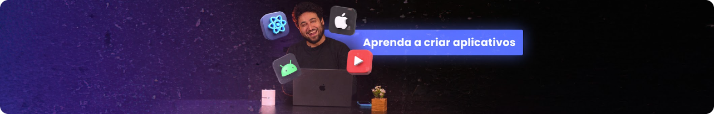

<h1 align="center">
  
  
</h1>

### Sobre o projeto

Imagine que Rodrigo deseja comprar um Notebook novo que custa R$ 5.000,00. Ele acha prudente poupar o dinheiro necessário para comprar à vista, conseguir um bom preço e não comprometer o orçamento com parcelas.
Por isso, pode usar esse App Minhas Metas para poupar até atingir sua meta financeira para adquirir um Notebook novo. Esse é um dos projetos desenvolvidos em aula do evento React Native na Prática.

---

### Tecnologias
- [Nativewind](https://www.nativewind.dev/)
- [TailwindCSS](https://tailwindcss.com/)
- [React Native](https://reactnative.dev/)
- [Expo](https://docs.expo.dev/)
- [Expo SQLite](https://docs.expo.dev/versions/latest/sdk/sqlite/)
- [Zod]()
- [React Hook Form]()